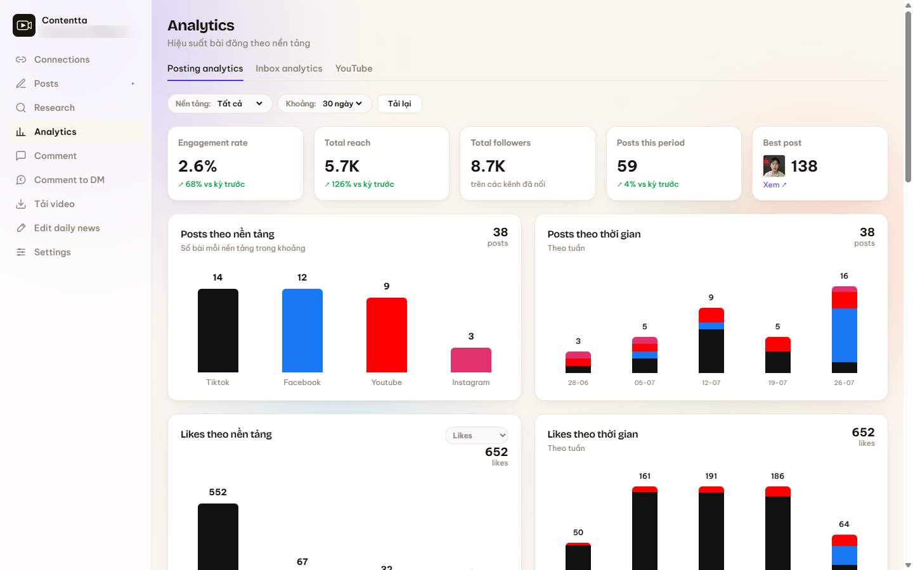
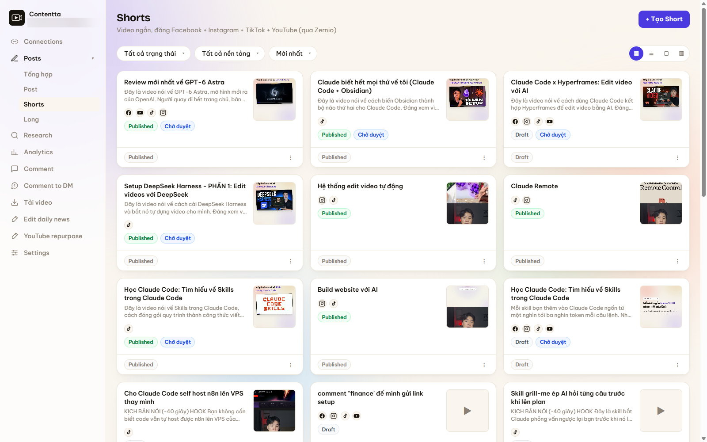
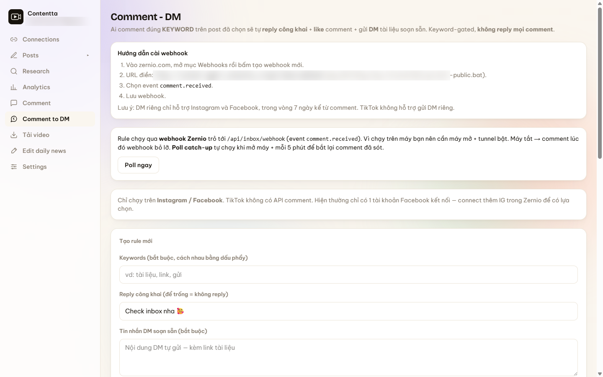
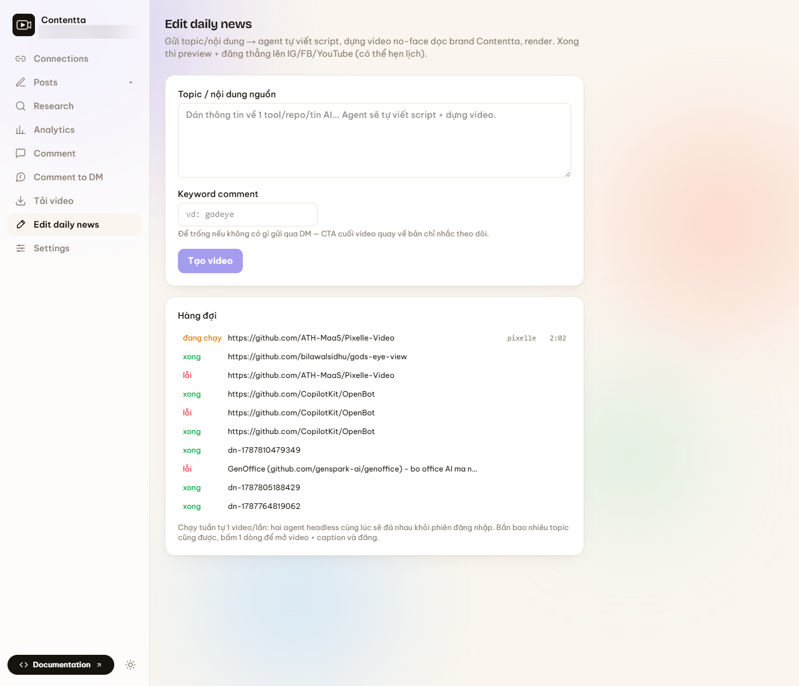

# Contentta Content Agent

App local-first để viết, quản lý, đăng và đo nội dung đa nền tảng bằng Claude Code. App chạy trên máy bạn tại `http://localhost:8502`. File Markdown trong `content/` là nguồn dữ liệu chính, không có database.

Ngoài phần viết và đăng bài, repo này kèm luôn pipeline dựng video dọc 1080x1920: biến một link YouTube dài thành post kèm clip và một video tóm tắt, hoặc dựng video tin tức AI hằng ngày từ một chủ đề.



*Trang Analytics tổng hợp số liệu đăng bài của mọi kênh đã kết nối.*

## Làm được gì

| Nhóm | Việc cụ thể |
|---|---|
| Viết | Script video dài, video ngắn, post. AI viết bằng Claude Code trên máy hoặc bạn tự dán nội dung |
| Ảnh | Thumbnail, ảnh vuông, carousel dựng bằng Satori, không tốn API ảnh |
| Đăng | Facebook, Instagram, TikTok, YouTube, LinkedIn, Threads qua Zernio. Kèm comment tự động sau khi đăng |
| Group | Đăng vào group Facebook bằng Playwright và group Zalo qua relay |
| Đo | Analytics theo bài, inbox và comment tổng hợp, tự trả lời comment thành DM |
| Research | Báo cáo trend hằng ngày từ X, Reddit, GitHub, YouTube |
| Video | `/edit/youtube` biến 1 link YouTube thành post kèm clip và video dọc tóm tắt. `/edit/daily-news` dựng video tin AI từ 1 chủ đề |



*Trang Shorts: mỗi video là 1 file Markdown, hiện trạng thái và các nền tảng sẽ đăng.*



*Comment to DM: comment đúng keyword thì app tự reply công khai và gửi DM soạn sẵn.*



*Edit daily news: dán 1 chủ đề, agent viết script và dựng video dọc, hàng đợi hiện trạng thái từng job.*

## Cài nhanh

Yêu cầu tối thiểu để mở app: Git, Node.js `20.9+`.

Windows PowerShell:

```powershell
git clone https://github.com/thanhthuduc99/contentta-content-agent.git
cd contentta-content-agent
powershell -ExecutionPolicy Bypass -File .\scripts\setup.ps1
npm run dev
```

macOS, Linux hoặc WSL:

```bash
git clone https://github.com/thanhthuduc99/contentta-content-agent.git
cd contentta-content-agent
bash scripts/setup.sh
npm run dev
```

Mở `http://localhost:8502`.

Muốn Claude Code tự cài giúp, dán nguyên câu này cho nó:

```text
Hãy cài Contentta Content Agent từ https://github.com/thanhthuduc99/contentta-content-agent. Đọc README.md và CLAUDE.md trước, kiểm tra máy, clone repo, chạy script setup phù hợp, tạo .env từ .env.example nhưng không tự điền hoặc in secret, sau đó chạy app trên localhost:8502. Không tạo ảnh. Nếu thiếu key tuỳ chọn thì bỏ qua tính năng đó.
```

## Cần cài thêm gì cho từng tính năng

| Tính năng | Cần thêm |
|---|---|
| Mở app, quản lý Markdown, calendar, kanban | Không cần gì |
| AI viết và research | Claude Code CLI đã đăng nhập |
| Đăng bài, analytics, inbox, comment-to-DM | Zernio API key |
| Research TikTok và Reddit | Apify API key |
| YouTube analytics | YouTube API key hoặc OAuth |
| Tải video Facebook, Instagram, YouTube | `yt-dlp` |
| Tạo ảnh bằng Gemini | Gemini API key |
| Đăng vào group Facebook, Zalo | Python + Playwright, và VPS chạy zalo-relay nếu cần Zalo |
| Build video dọc | Claude Code CLI, ffmpeg, ffprobe, yt-dlp, Chrome, OpenAI API key |
| Mirror sang Obsidian | Điền đường dẫn vault trong `.env` |
| Custom domain | Cloudflare Tunnel + Cloudflare Access |

## Trước khi để AI viết

Sửa bốn chỗ sau để nội dung ra đúng giọng và đúng thứ bạn bán:

- `_system/voice-profile.md`
- `_system/business-context.md`
- `_system/skills/writing-patterns.md`
- `_system/templates/`

Đây là context app gửi cho Claude Code. Để nguyên placeholder thì output chỉ mang tính minh hoạ.

Claude Code dùng phiên đăng nhập sẵn trên máy, nên bạn không cần đặt Anthropic API key nếu đang dùng gói Claude phù hợp.

## Tài liệu

- [Hướng dẫn cài đặt đầy đủ](docs/SETUP.md)
- [Hướng dẫn sử dụng hằng ngày](docs/USAGE.md)
- [Build video dọc](docs/VIDEO-BUILD.md)
- [Cách lấy API key](docs/API-KEYS.md)
- [Dùng custom domain](docs/CUSTOM-DOMAIN.md)

## Cấu trúc

```text
contentta-content-agent/
├── web/          # Next.js 16 app, chạy port 8502
├── content/      # scripts, shorts, posts và media local
├── _system/      # voice profile, business context, template viết
├── research/     # báo cáo research
├── edit-agent/   # template và tools dựng video dọc
├── docs/         # hướng dẫn
└── .env          # secrets local, không commit
```

## Lưu ý về deploy

Đây không phải app stateless để bấm Deploy lên Vercel. App ghi file xuống ổ đĩa và gọi Claude Code CLI trên chính máy đang chạy. Cách phù hợp:

1. Chạy trên máy hoặc VPS bằng `npm run build` rồi `npm run start`.
2. Cần domain thì đưa `localhost:8502` ra ngoài bằng Cloudflare Tunnel.
3. Bắt buộc bảo vệ domain bằng Cloudflare Access, vì app có quyền đọc ghi nội dung và gọi mọi tích hợp đã kết nối.

## Bảo mật

- Không commit `.env`, `web/data/app-keys.json`, browser profile hay token.
- Chỉ cấp quyền tối thiểu cho API key, nghi lộ thì xoay key ngay.
- Không mở thẳng port `8502` ra Internet.
- Không dùng Quick Tunnel cho production, dùng named tunnel kèm Access policy.

## License

MIT. Xem [LICENSE](LICENSE).
